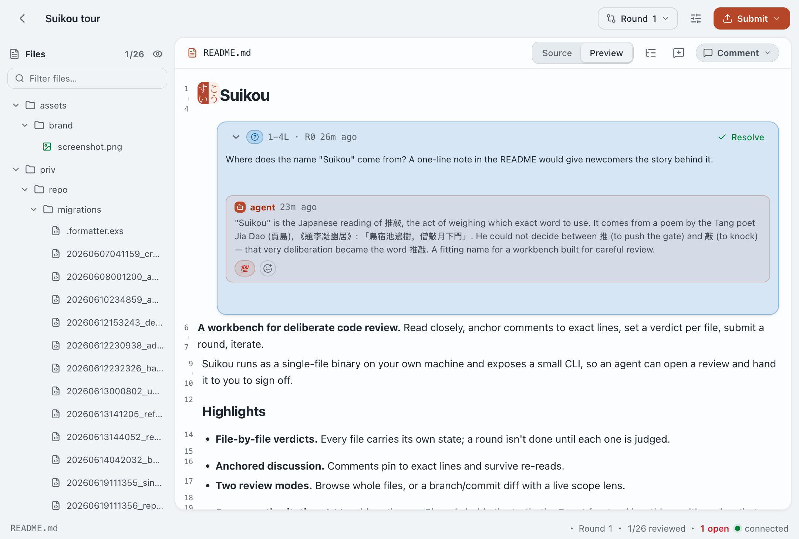

<h1>
  
  Suikou
</h1>

**A workbench for deliberate code review.** Read closely, anchor comments to
exact lines, set a verdict per file, submit a round, iterate.

Suikou runs as a single-file binary on your own machine and exposes a small CLI,
so an agent can open a review and hand it to you to sign off.



## Highlights

- **Every artifact, rendered right.** Code with syntax highlighting, Markdown
  with tables and Mermaid diagrams, HTML as a live preview, images inline — each
  file shows in the form you actually review it in.
- **Line-precise comments.** Select a line or a range and pin a comment to it;
  on HTML, click any element instead. Anchors survive re-reads and diffs.
- **Structured critique.** Every comment carries intent — a required fix, a
  question that needs an answer, or a note — so an agent can act on it directly.
- **File-by-file verdicts.** Every file carries its own state; a round isn't done
  until each one is judged.
- **Two review modes.** Browse whole files, or a branch/commit diff scoped to
  just what changed.
- **Rendered HTML review.** HTML files render live in a sandboxed preview —
  click any element to pin a comment to it, or flip to interactive to click
  through the page.
- **Round-based iteration.** Submit a round, hand it back, pick up the reply —
  the review always resumes exactly where you left it.
- **Agent in the loop.** A small CLI lets an agent open a review, wait for your
  critique, reply in-thread to each comment, and flag its work status.
- **Yours alone.** Single user, no cloud, runs on your own machine and reachable
  from any of your devices.

## Package & install

Requires [mise](https://mise.jdx.dev) (provisions Elixir/Erlang/Bun).

`mise run package` builds the whole app — React frontend, a self-contained
`mix release` (ERTS bundled), and the bun launcher — into one file at
`dist/suikou`. It's xattr-stripped and ad-hoc signed in place, and the signature
is embedded in the Mach-O, so **copying it anywhere keeps it valid** — no
re-sign step. It does **not** install; copy it onto your `PATH` and restart the
daemon so the new binary and any `config.toml` changes take effect:

```sh
mise run package
cp dist/suikou ~/.local/bin/suikou   # signature survives the copy
suikou start --force                 # (re)boots the new binary, opens the browser
```

Or build straight onto your `PATH` with `OUT=<path>`, then restart the daemon:

```sh
OUT=~/.local/bin/suikou mise run package
suikou start --force
```

Lifecycle state lives in `~/Library/Application Support/Suikou` (independent of
the binary), so `stop`/`start` reach the daemon across versions. Targets the
host platform only (macOS arm64).

### Run

```sh
suikou           # foreground, opens the browser; Ctrl-C stops it
suikou start     # background daemon, opens the browser
suikou stop      # stop the daemon
suikou status    # is the daemon running, and where
suikou skill     # print the agent CLI skill markdown (no server needed)
```

## Develop

Server-authoritative: a Musubi runtime on Phoenix (SQLite) holds the truth; the
React frontend is a thin, realtime view that resumes instantly from a cached PWA
shell. Reachable from any device over Tailscale.

```sh
mix setup        # install deps + set up the database
mise run dev     # Phoenix (distributed node, :4710) + Vite (:5173) together
mix precommit    # format, compile --warnings-as-errors, test — run before pushing
```

`mise run cli -- <args>` drives the agent CLI against the live dev node (e.g.
`mise run cli -- review list --project <id>`).

## Install the agent skill

`suikou skill` emits the CLI skill doc that teaches an agent to drive a review
loop — create a review, wait for the human's critique, fix the code, reply to
each comment. It reads the doc baked into the binary, so it works before the
server (or anything) is running; an agent can install it for itself.

Write it into the agent's skills directory. For Claude Code:

```sh
suikou skill -o ~/.claude/skills/suikou/SKILL.md   # --force to overwrite
```

Or just ask the agent to install it — paste this prompt:

```text
Install the Suikou skill for yourself by running `suikou skill`.
```

Restart the agent to pick it up. Point `-o` at whatever path your agent reads
skills from; with no `-o` it prints to stdout (`suikou skill > SKILL.md`).

## Configure

Runtime config is read once at boot from `~/.config/suikou/config.toml` (packaged
build only; dev/test ignore it). Every key is optional and documented inline in
[`config.toml.example`](config.toml.example) — copy it, edit, then
`suikou stop && suikou start` to apply.

## Notifications

An agent can push a notification asking you to come review — `suikou review
notify <review-id> --message "…"` delivers a Web Push to every browser you've
opted in, and tapping it opens the review. Opt in **per browser** under
**Settings → Notifications**; the subscription lives in that browser only.

Web Push runs only in a **secure context** — HTTPS, or `localhost`. Two cases:

- **Desktop, this machine.** The app opens on `http://localhost:<port>`, which
  already counts as secure — enable the toggle and you're done. No VAPID setup
  needed; the launcher generates and persists the keypair on first run.
- **Phone (or any other device) over the tailnet.** Plain HTTP over a MagicDNS
  name is *not* a secure context, so the toggle stays disabled there. Front the
  app with HTTPS so the browser trusts it:

  ```sh
  # Publish the local server over HTTPS at your MagicDNS name (adjust the port to
  # your config.toml `port`; see `tailscale serve --help` for your version).
  tailscale serve --bg 47100
  ```

  This stays **private to your tailnet** — it is not `tailscale funnel`, so
  nothing is exposed to the public internet. Then point generated links at that
  HTTPS front in `config.toml`:

  ```toml
  url_scheme = "https"
  url_port = 443
  ```

  Restart (`suikou stop && suikou start`), open the app at
  `https://<your-magicdns-name>/` on the phone, install the PWA, and enable the
  toggle. `suikou review notify` reports `delivered` — how many browsers accepted
  the push (`0` means nobody has opted in yet).

Pushes identify their sender by a VAPID contact address, defaulting to the
project's (`mailto:pwa@suikou.ai`). Set `notification_subject` in `config.toml` to
be reached directly instead; it must stay a real address, since Apple refuses a
localhost one.
