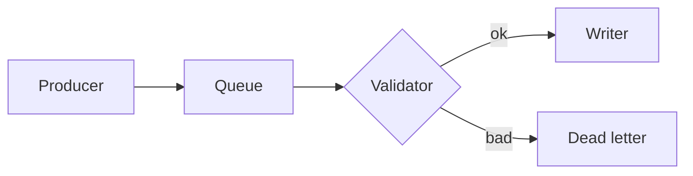

# Block & Width Test Doc

A single document that exercises every commentable block type and stresses
horizontal-scroll behaviour with a deliberate mix of short and very long
content. Use it to sanity-check the line-number gutter, sticky alignment, and
the table / code-fence horizontal scroll.

## Prose and headings

### A third-level heading

This is an ordinary prose paragraph. It wraps normally and should anchor on a
single line range. The sentence is intentionally a little long so the wrapped
paragraph spans more than one visual row, which is useful for checking that the
gutter stays aligned with the first line of the block.

Another short paragraph follows, to give two adjacent prose blocks.

## Lists

A bulleted list:

- First bullet, short.
- Second bullet with a noticeably longer line of text that keeps going to verify wrapping inside a list item without triggering horizontal scroll.
- Third bullet with a nested list:
  - Nested item one.
  - Nested item two.

A numbered list:

1. Step one is short.
2. Step two has a nested ordered list:
   1. Sub-step A.
   2. Sub-step B.
3. Step three is the last one.

## Definition list

Ingest
: The stage that accepts raw events and validates them before anything is written.

Backpressure
: A flow-control signal that slows producers when a downstream consumer cannot keep up. This definition is intentionally long so it wraps across more than one line within the definition body.

## Blockquote

> This is the first paragraph of a multi-paragraph blockquote. It states the
> open question and gives some surrounding context for the reviewer to react to.
>
> This is the second paragraph of the same blockquote. It continues the thought
> and exists so we can confirm that multi-paragraph quotes anchor and render as
> one quoted block.

## Footnotes

The validator rejects malformed events[^one] and the writer commits in
batches[^two]. Both behaviours are covered below.

[^one]: A malformed event is one that fails schema validation — missing `id`, a future timestamp, or an oversized payload.
[^two]: Batches commit every 200ms or when the buffer reaches its size cap, whichever comes first.

## Code block (mixed line widths)

```typescript
type Event = { id: string; ts: string; payload?: Uint8Array };

const ok = (e: Event): boolean => Boolean(e.id) && new Date(e.ts).getTime() <= Date.now();

function normalize(raw: unknown): Event {
  return raw as Event;
}

// The following line is intentionally very long to force the code fence to scroll horizontally instead of wrapping, so we can verify the sticky gutter stays pinned to the left while the rest of the fenced block slides under it.
export const writeBatch = (batch: Event[]): Event[] => batch.filter(ok).map(normalize).map((e) => ({ ...e, ingestedAt: new Date().toISOString(), checksum: simpleChecksum(e.id + e.ts) }));

const x = 1;
```

## Table (mixed row widths)

| Field | Rule | Required | Notes |
| ----- | ---- | -------- | ----- |
| `id` | UUIDv7 | yes | short |
| `ts` | ISO-8601 | yes | short |
| `payload` | This rule cell is deliberately enormous so the table overflows its container and triggers horizontal scrolling: the payload must be at most 256 KiB after base64 decoding, must not contain control characters, and must be rejected with a descriptive error when any of these invariants are violated during ingest. | no | this row is the wide one |
| `source` | enum | no | short |

## Mermaid diagram



## Image


End of document.
